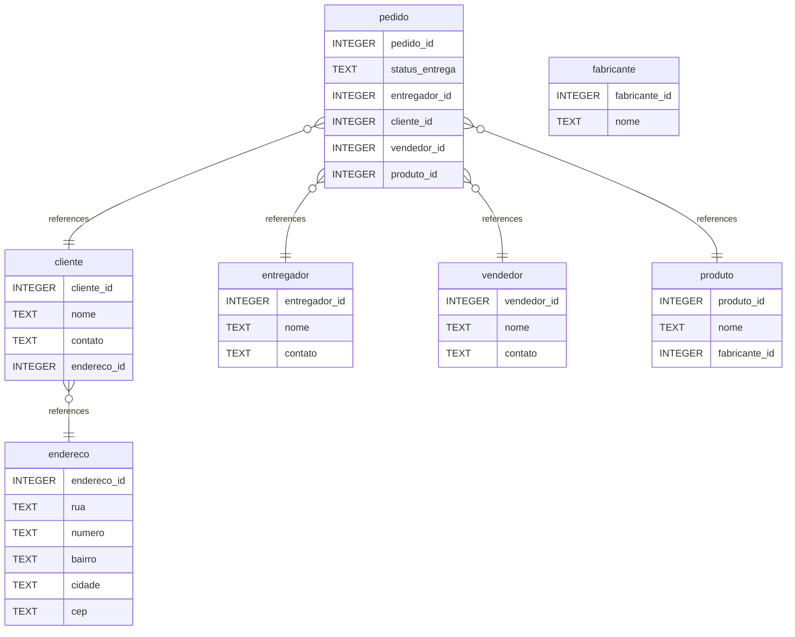

# Untitled Diagram documentation
## Summary

- [Introduction](#introduction)
- [Database Type](#database-type)
- [Table Structure](#table-structure)
	- [entregador](#entregador)
	- [endereco](#endereco)
	- [cliente](#cliente)
	- [vendedor](#vendedor)
	- [fabricante](#fabricante)
	- [produto](#produto)
	- [pedido](#pedido)
- [Relationships](#relationships)
- [Database Diagram](#database-diagram)

## Introduction

## Database type

- **Database system:** SQLite
## Table structure

### entregador

| Name        | Type          | Settings                      | References                    | Note                           |
|-------------|---------------|-------------------------------|-------------------------------|--------------------------------|
| **entregador_id** | INTEGER | 🔑 PK, null |  | |
| **nome** | TEXT | not null |  | |
| **contato** | TEXT | not null |  | | 

### endereco

| Name        | Type          | Settings                      | References                    | Note                           |
|-------------|---------------|-------------------------------|-------------------------------|--------------------------------|
| **endereco_id** | INTEGER | 🔑 PK, null |  | |
| **rua** | TEXT | not null |  | |
| **numero** | TEXT | not null |  | |
| **bairro** | TEXT | not null |  | |
| **cidade** | TEXT | not null |  | |
| **cep** | TEXT | not null |  | | 

### cliente

| Name        | Type          | Settings                      | References                    | Note                           |
|-------------|---------------|-------------------------------|-------------------------------|--------------------------------|
| **cliente_id** | INTEGER | 🔑 PK, null |  | |
| **nome** | TEXT | not null |  | |
| **contato** | TEXT | not null |  | |
| **endereco_id** | INTEGER | null | fk_cliente_endereco_id_endereco | | 

### vendedor

| Name        | Type          | Settings                      | References                    | Note                           |
|-------------|---------------|-------------------------------|-------------------------------|--------------------------------|
| **vendedor_id** | INTEGER | 🔑 PK, null |  | |
| **nome** | TEXT | not null |  | |
| **contato** | TEXT | not null |  | | 

### fabricante

| Name        | Type          | Settings                      | References                    | Note                           |
|-------------|---------------|-------------------------------|-------------------------------|--------------------------------|
| **fabricante_id** | INTEGER | 🔑 PK, null |  | |
| **nome** | TEXT | not null |  | | 

### produto

| Name        | Type          | Settings                      | References                    | Note                           |
|-------------|---------------|-------------------------------|-------------------------------|--------------------------------|
| **produto_id** | INTEGER | null |  | |
| **nome** | TEXT | not null |  | |
| **fabricante_id** | INTEGER | null |  | | 

### pedido

| Name        | Type          | Settings                      | References                    | Note                           |
|-------------|---------------|-------------------------------|-------------------------------|--------------------------------|
| **pedido_id** | INTEGER | 🔑 PK, null |  | |
| **status_entrega** | TEXT | not null |  | |
| **entregador_id** | INTEGER | not null | fk_pedido_entregador_id_entregador | |
| **cliente_id** | INTEGER | not null | fk_pedido_cliente_id_cliente | |
| **vendedor_id** | INTEGER | not null | fk_pedido_vendedor_id_vendedor | |
| **produto_id** | INTEGER | not null | fk_pedido_produto_id_produto | | 

## Relationships

- **cliente to endereco**: many_to_one
- **pedido to entregador**: many_to_one
- **pedido to cliente**: many_to_one
- **pedido to vendedor**: many_to_one
- **pedido to produto**: many_to_one

## Database Diagram

